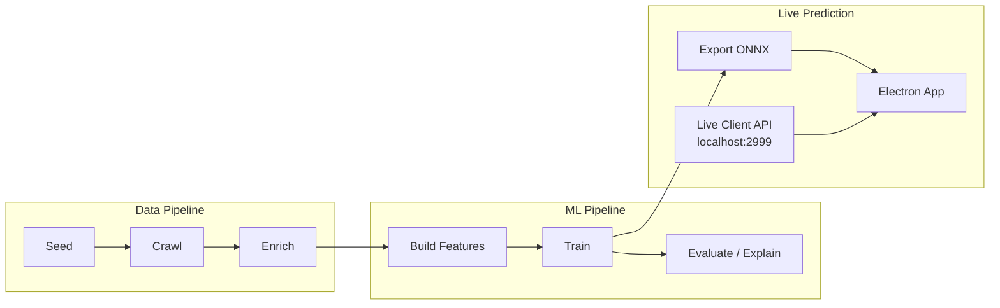
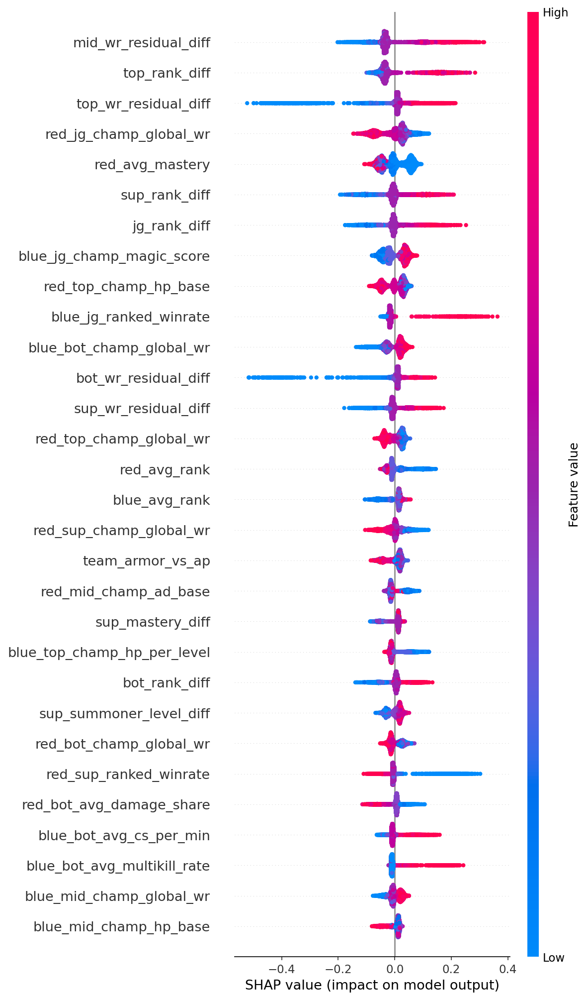
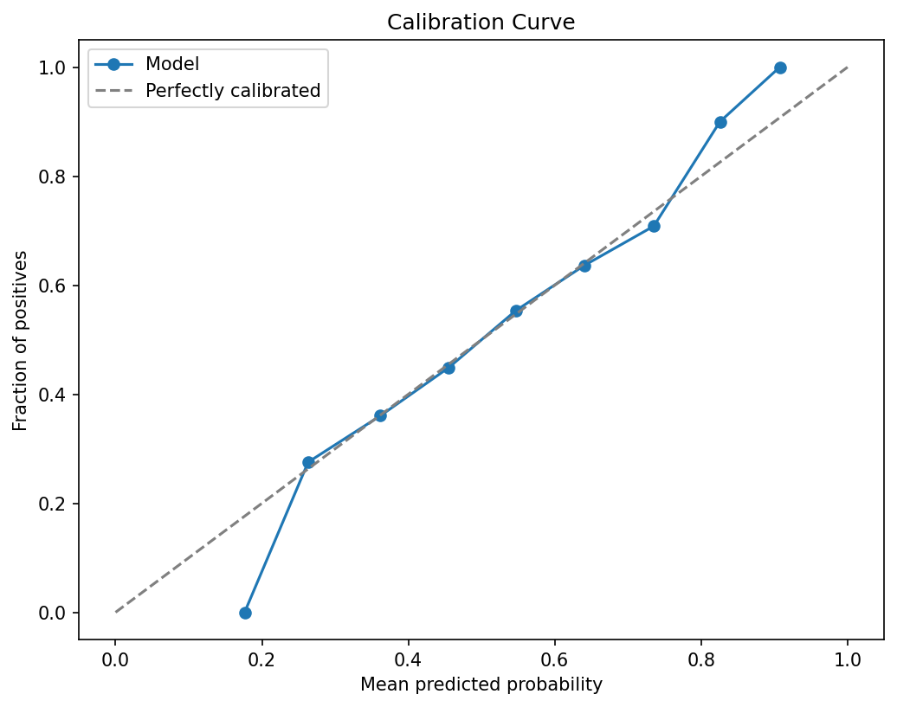

# lol-genius

[](https://github.com/EricBriscoe/lol-genius/actions/workflows/ci.yml)
[](LICENSE)
[](https://www.python.org/downloads/)

Pre-game League of Legends match outcome predictor. Crawls ranked match data from the Riot Games API, engineers features from player/champion/team/draft dimensions, and trains an XGBoost binary classifier with SHAP interpretability.

## Architecture



| Component | Description |
|-----------|-------------|
| `crawler/` | Snowball match collector + participant enrichment |
| `features/` | Feature engineering (~160 pregame + timeline features) |
| `model/` | XGBoost training, evaluation, SHAP, ONNX export |
| `predict/` | Live Client API poller for in-game predictions |
| `dashboard/` | FastAPI backend for the web dashboard |
| `frontend/` | React + Recharts dashboard UI |
| `proxy/` | Riot API proxy with caching and rate limiting |
| `electron-app/` | Standalone desktop app for live predictions |

## Model Performance

The pregame model predicts blue team win probability using ~160 features derived entirely from pre-game data (no target leakage). SHAP values reveal which features drive each prediction.

**SHAP Summary** — top features by impact on model output:



**Calibration Curve** — predicted probabilities closely match observed win rates:



## Electron App

Download the latest installer from [Releases](https://github.com/EricBriscoe/lol-genius/releases). The desktop app runs on your gaming PC and connects directly to the League Live Client API (`localhost:2999`) for real-time win probability predictions — no port forwarding needed.

## Docker Compose Quickstart

```bash
cp .env.example .env
# Edit .env with your RIOT_API_KEY and POSTGRES_PASSWORD

docker compose up -d
```

This starts PostgreSQL, the Riot API proxy, crawler, dashboard API, and dashboard UI. Access the dashboard at `http://localhost:3000`.

## Local Development Setup

```bash
python -m venv .venv
source .venv/bin/activate
pip install -e ".[test]"
brew install dbmate
```

Copy `.env.example` to `.env` and add your [Riot API key](https://developer.riotgames.com/).

Edit `config.yaml` to configure your target region, elo bracket, and match count.

## Usage

```bash
# Initialize database
lol-genius init-db

# Download champion data
lol-genius fetch-ddragon

# Seed + crawl + enrich (automated supervisor)
lol-genius seed
lol-genius crawl

# Build features and train
lol-genius build-features
lol-genius train              # pregame model
lol-genius train --live       # live (in-game) model
lol-genius train --tune       # with hyperparameter search

# Evaluate and explain
lol-genius evaluate
lol-genius explain

# Export for Electron app
lol-genius export-model --format onnx --type live

# Predict a specific match
lol-genius predict NA1_1234567890

# Check progress
lol-genius status
```

## Feature Taxonomy

~160 features across four dimensions, all pre-game knowable (no target leakage):

- **Player-level** (x10): rank, winrate, champion proficiency, mastery, KDA, CS/min, vision, damage share, autofill flag
- **Champion-level** (x10): base stats, scaling, damage type, role tags
- **Team-level** (x2): average rank, rank spread, damage mix, composition profile
- **Draft-level**: per-lane matchup differentials, blue/red side

The live model adds ~50 timeline features (kills, towers, dragons, momentum, scaling interactions).

## Rate Limits

With a personal Riot API key (20 req/s, 100 req/2min), expect:
- **Seeding**: ~5 minutes
- **Crawling 50k matches**: ~12 hours
- **Enrichment**: 1-3 days (heavily cached across overlapping players)

The crawler is fully resumable — stop and restart at any time.

## License

[MIT](LICENSE)
